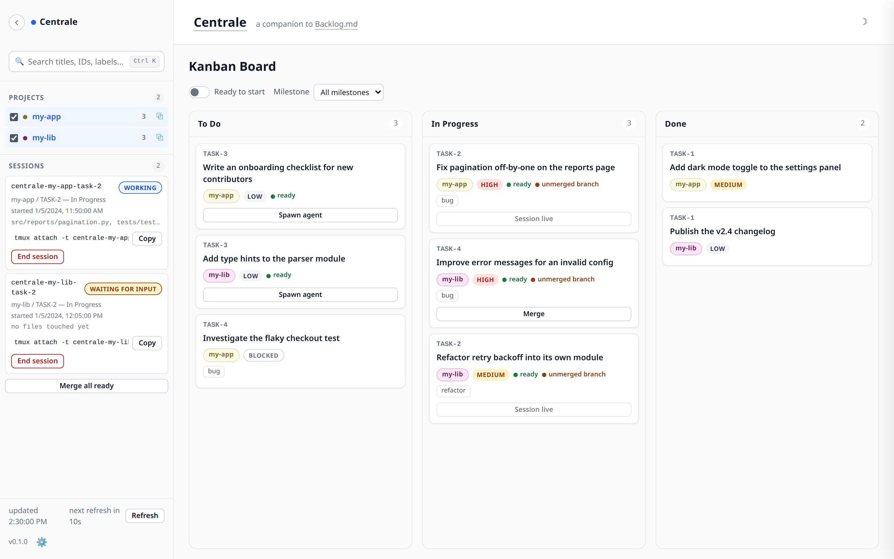
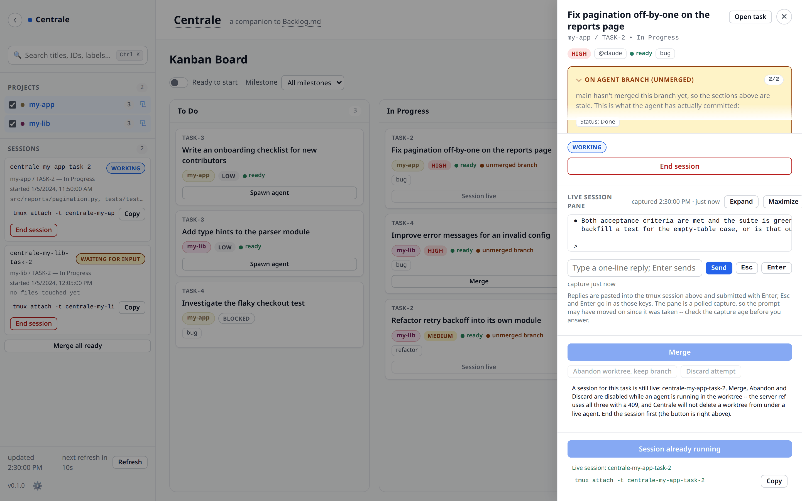
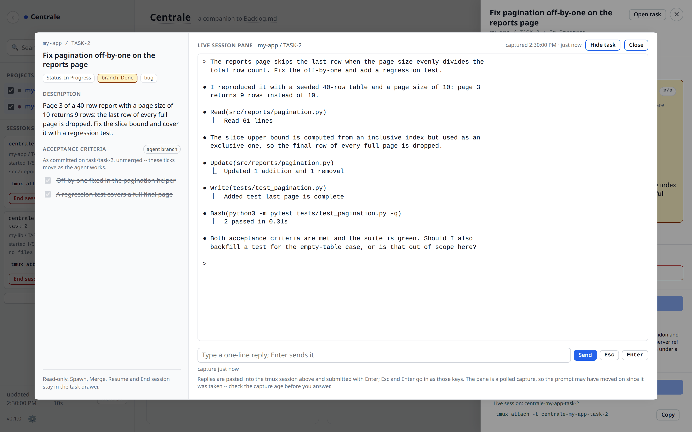

# Centrale

**One board for all your [Backlog.md](https://github.com/MrLesk/Backlog.md)
projects: spawn coding agents from it, merge their work through safety gates.**

[](LICENSE)
[](#requirements)

```bash
git clone https://github.com/levantlabs/centrale.git centrale
cd centrale
python3 server.py --check     # doctor: reports anything missing, starts nothing
python3 server.py             # the board is at http://127.0.0.1:7420
```

<picture>
  <source media="(prefers-color-scheme: dark)" srcset="docs/img/board-dark.png">
  
</picture>

*The board, light and dark — every configured project in one set of columns,
live agent sessions in the sidebar.*

Centrale is a thin local dashboard companion to
[Backlog.md](https://github.com/MrLesk/Backlog.md), the MIT-licensed task
tracker it is built entirely on top of. It aggregates the kanban board from
every repo you point it at into one view, can launch a coding agent (Claude
Code, Codex, or a CLI of your own) directly on a ready task inside its own git
worktree, and merges that agent's finished branch back only once it passes
explicit safety gates.

Centrale stores no task data of its own. Every repo's `backlog/` folder stays
the single source of truth, read through the `backlog` CLI's `--json` output
rather than by parsing `backlog/tasks/*.md`; sessions come from `tmux` and
branch state from `git`, re-derived on every read. What Centrale does keep is
its own housekeeping — `projects.json`, two small files under
`~/.cache/centrale/` (a registry of browser processes it launched, and the
agent-hooks settings it hands a spawn), and a few `centrale-` prefixed
`localStorage` keys for your filter and theme choices. Delete Centrale
entirely and no task data is lost.

## Screenshots

A task's drawer: what the agent has actually committed on its unmerged branch,
the live tmux pane below it, and a reply box that types straight into the
session:



The same pane and reply row in the session theater, for reading and answering
at length:



(Every screenshot here — the board above included — uses synthetic project and
task data; no real repository is shown.)

## Quickstart

There is no build step, no `pip install`, and no config file to write: the four
commands at the top of this page are the whole install. The one thing you do
need first is the [Backlog.md](https://github.com/MrLesk/Backlog.md)
CLI, which Centrale reads every board through — `npm i -g backlog.md` (see
[Requirements](#requirements) for the other install routes and what else is
optional).

Then open <http://127.0.0.1:7420>. A fresh clone boots straight into an empty
board with sane defaults, so the remaining setup happens in the UI:

1. **Add a project** from the gear icon at the bottom of the sidebar: a name
   and a path to any git repo. If that repo has no board yet, tick the option
   to run `backlog init` in it.
2. **Add an agent**, if the built-in `claude` and `codex` entries aren't what
   you run. The gear's **Agents** section edits the same `agents` map
   `projects.json` holds: a name (matched against a task's `@assignee`), a
   command line (`claude --model sonnet`, or anything else that takes a prompt
   as its trailing argument), and an optional prompt suffix. An executable
   that isn't on `PATH` is a warning, not a blocked save.

Prefer a config file to the UI? Copy the shipped example, **edit it**, and
start from there instead — the same keys, documented in
[docs/configuration.md](docs/configuration.md#setup--configuration):

```bash
cp projects.example.json projects.json
$EDITOR projects.json          # point "projects" at repos that exist on this machine
python3 server.py
```

The edit is not optional: the example ships two placeholder entries
(`~/code/my-app`, `~/code/my-lib`) that are there to show the shape. Left as
they are, both paths are missing and the board renders two error banners
instead of columns. Replace them with your own repos — or delete them and add
projects from the gear icon as above.

## What it does

**One board across repos.** Columns are the union of every configured
project's own statuses; cards carry a project chip, priority, labels, a green
"ready" dot or a "blocked" badge, and an amber "unmerged branch" dot when
`main` hasn't yet seen what an agent committed. A search box (title, task ID,
or label) and a "Ready to start" filter narrow it down, per-project show/hide
and that filter persist across reloads, and a project that fails to load
degrades to an error banner instead of taking the board down. → [docs/board.md](docs/board.md#using-the-board)

**A drawer that shows the branch, not just `main`.** Clicking a card opens the
task's description, acceptance criteria, dependencies, plan and notes. When an
agent has a branch in flight, a separate **"On agent branch (unmerged)"**
section shows that branch's own status, checked criteria and notes — the work
as actually committed, which `main` cannot see yet.
→ [docs/board.md](docs/board.md#using-the-board)

**Read and answer a running agent without attaching.** For a task with a live
session, the drawer tails the rendered tmux pane as plain text every ~2
seconds, with a capture timestamp and age, and a one-line reply box that
delivers your answer into the session as a bracketed paste followed by Enter —
refused whenever the capture is stale or the session is gone. Beside it, **Esc**
and **Enter** buttons send those two keys themselves, for a session parked on a
startup dialog that no amount of typed text can answer. **Expand** widens
the drawer to the full 80-column grid; **Maximize** opens the *session
theater*, the same pane and reply row in a large in-page overlay, with Esc
returning you to the drawer exactly as it was. It costs one `tmux capture-pane`
per tick for the one open drawer, however many agents are running, and a
Settings toggle turns the whole tier off, server endpoint included.
→ [docs/board.md](docs/board.md#using-the-board)

**Spawning, routed by assignee.** "Spawn agent" claims the task (`In Progress`,
committed to the repo), cuts a `task/<id>` worktree and branch, and starts the
agent in its own tmux session with the standard Backlog.md workflow prompt.
*Which* CLI runs is read from the task's own `@assignee`, so a board can mix
`@claude`, `@codex` and your own entries and each task launches what it asks
for. → [docs/agents.md](docs/agents.md#spawning-an-agent)

**Guards instead of surprises.** Spawning or resuming a task that is already
`Done` is refused outright. Spawning one already claimed by a worker the board
cannot see — `In Progress`, with no Centrale session and no branch — arms a
confirm that names who claimed it and how long ago, rather than quietly
starting a second agent on the same work. A branch left behind by a session
that died mid-work is offered Resume — whether it left uncommitted changes or
had just committed them, since a task still in an active status with no live
session is an interrupted task either way.
→ [docs/agents.md](docs/agents.md#spawn-guards)

**Honest lifecycle badges.** Working / waiting for input / finished for Claude,
plus a deliberately honest "turn ended · may need input" idle state for codex,
which cannot distinguish a finished task from a turn that ended waiting. Badges
come from agent lifecycle events the CLI itself emits (native Claude Code
hooks, or codex's `-c` hook overrides on a hooks-capable version) — never
inferred from CPU or tmux pane activity.
→ [docs/agents.md](docs/agents.md#agent-lifecycle-events)

**Six-gate merging, by click or hands-off.** A finished branch merges only
after five gates pass — no live session, the task actually `Done` with every
acceptance criterion checked, a clean worktree, a conflict-free dry-run merge,
and an optional per-project test command run against the *merged* tree — plus a
sixth immediate re-check of the destination checkout right before the real
merge. Run them one branch at a time from a button, all ready branches at once
from the sidebar, or set `harvest.mode` to `"auto"` and let a background thread
do it. → [docs/merging.md](docs/merging.md#merging-finished-branches)

**Work done outside Centrale still fits.** A `task/<id>` branch adopted into a
foreign worktree is detected from `git` alone: the card says "worked
externally", the drawer names the checkout path and the branch's last-commit
age, and Spawn, Resume and Merge disable themselves with that reason instead of
failing later. Remove the foreign worktree and the branch parks; the ordinary
Merge — clicked or automatic — adopts it, no Centrale spawn required. A branch
someone merged by hand is offered a one-click worktree and branch cleanup.
→ [docs/agents.md](docs/agents.md#branches-worked-outside-centrale)

**A bad attempt has a way out.** When a spawn produces nothing worth keeping,
the drawer offers to discard it — worktree removed, branch deleted, task back
to an ordinary Spawn so the next agent starts fresh from the base. The
confirming click names exactly what goes ("3 commits and 4 uncommitted
files"), and the commits are tagged before they are deleted, so the recovery
command Centrale hands back keeps working. A milder action next to it just
frees the worktree and leaves the branch parked and mergeable.
→ [docs/agents.md](docs/agents.md#discarding-a-bad-attempt)

## Requirements

- **Linux, or macOS.** Development and the test suite run on Linux, and that
  is the only platform Centrale has actually been exercised on. macOS is
  supported on a best-effort basis: process inspection falls back from
  `/proc` and `ss` to `ps` and `lsof`, so the orphaned-`backlog browser`
  cleanup works there too, but it has not been run on a Mac. If neither
  method can confirm what a pid is, Centrale kills nothing — the worst case
  is a leftover browser process, never a wrong one killed. The AppArmor
  troubleshooting in [operations.md](docs/operations.md#troubleshooting) is
  Linux-only. Windows is not supported.
- **Python 3.12+**, standard library only — no `pip install`, no virtualenv.
- The **[`backlog`](https://github.com/MrLesk/Backlog.md) CLI** on `PATH` —
  the one hard dependency; without it there is no task data and nothing works.
  It ships as a global **npm** package, so it needs **Node.js and `npm`**
  (Backlog.md publishes no minimum version; Centrale is verified against
  `backlog` v1.51.0 on Node 20, `--json` `schemaVersion: 1`):

  ```bash
  npm i -g backlog.md
  backlog --version
  ```

  That stated version is not prose: it is `TESTED_BACKLOG_VERSION` in
  `version.py`, a test keeps this paragraph equal to it, and no release
  can be cut on a machine running a different one. `python3 server.py
  --check` prints your installed version next to it and says so plainly
  when the two differ — **informational only**. Backlog.md releases
  often, so being ahead of the baseline is the normal state of a healthy
  machine; nothing fails, nothing refuses to start, and there is nothing
  to fix. The line is there so that if the board ever misreads a task,
  the version gap is already in front of you.

  [Other install routes](https://github.com/MrLesk/Backlog.md#installation)
  (Bun, Homebrew, Nix) work equally well — Centrale only ever calls the
  `backlog` executable. Installing it once, on `PATH`, is all Centrale needs
  from your machine.
- **A `backlog/` board in every repo you aggregate** — a `backlog/config.yml`
  and its task files, created by `backlog init` in that repo. This is
  per-repo, not per-machine: the CLI above is installed once, but a repo
  without a board has nothing for Centrale to read. Centrale can run
  `backlog init` for you when you add the project.
- **`git`** on `PATH`, for worktree management.
- **`tmux`** on `PATH`, for spawning agent sessions — optional; the board,
  drawer and merging all work fully without it, see
  [Without tmux](docs/agents.md#without-tmux).
- The **`claude` and/or `codex` CLIs**, only if you want Centrale to spawn
  them — optional; point the `agents` config at any CLI of your own that
  accepts a prompt as a trailing argument.
- **A browser.** The frontend (`static/index.html`, one `static/*.js` file
  per concern, `static/styles.css` and `static/favicon.svg`) is plain
  HTML/CSS/JS with no build step and no CDN assets.

## Documentation

The manual lives in focused chapters under `docs/`:

| Chapter | What's in it |
| --- | --- |
| [configuration.md](docs/configuration.md) | The `projects.json` reference — every key, the `agents` map, `spawnPrompt`, `worktreeRoot`/`@repo` — and the Settings view that edits a whitelisted subset of it live. |
| [board.md](docs/board.md) | The task lifecycle map — every state a task moves through, what each one offers and why the rest is absent — then using the board: cards, filters, the drawer, the live session pane, the theater, replying, and opening a project's own Backlog.md board. |
| [agents.md](docs/agents.md) | Spawning (guards, agent selection, the prompt), resuming an interrupted agent, reconciling a branch that fell behind, branches worked outside Centrale, lifecycle events, the multi-agent workflow, `CENTRALE_SPAWN_CMD`, and running without tmux. |
| [merging.md](docs/merging.md) | Merging finished branches: the six gates in detail, the card and drawer states, auto mode, and what merge ownership does and doesn't certify. |
| [operations.md](docs/operations.md) | Running it (`--check`, restarting after a change, systemd), cleanup, troubleshooting, the test suite, the manual smoke test, regenerating the documentation screenshots, limitations, and releasing. |
| [api.md](docs/api.md) | The HTTP API reference: every endpoint, a real response for each, and every error status. |
| [architecture.md](docs/architecture.md) | Module layout and how a spawn flows end to end. |

[MANIFESTO.md](MANIFESTO.md) sits above all of it: the positions Centrale
holds, and the incident behind each — why it derives rather than remembers,
gates rather than trusts, and refuses to touch a task's status on your behalf.
Read it if you want the *why* rather than the *what*.

Contributors should start with
[CONTRIBUTING.md](CONTRIBUTING.md) — how a pull request here actually
reaches the code, how to run both test tiers, and the house rules a review
applies — then the manifesto above, [AGENTS.md](AGENTS.md) for the ground
rules and [docs/architecture.md](docs/architecture.md) for the module layout.

### The API

All responses are JSON; errors are `{"error": "<message>"}` with a 4xx or 5xx
status, and the server never leaks a traceback to the client. `GET /` serves
`static/index.html` and `GET /static/*` the other assets it pulls in
(the per-concern `*.js` files, `styles.css`, `favicon.svg`). Every routed endpoint — `GET /api/board`, `/api/task`, `/api/sessions`, `/api/session-pane`,
`/api/harvest`, `/api/harvest-progress`, `/api/discard-preview`, `/api/settings`, and `POST /api/spawn`, `/api/resume`,
`/api/harvest`, `/api/agent-event`, `/api/end-session`, `/api/session-input`,
`/api/cleanup-branch`, `/api/discard-attempt`, `/api/abandon-worktree`,
`/api/browser`, `/api/settings` — is documented in full
in [docs/api.md](docs/api.md), including the `CENTRALE_EVENT_URL` contract a
custom agent uses to report its own lifecycle.

Centrale binds `127.0.0.1` and has no authentication, but it does refuse
every request — `GET` as much as `POST` — that could not have come from its
own UI: `Host` must be a loopback name at the bound port (which is what
refuses DNS rebinding, where an attacker's hostname resolves to `127.0.0.1`
and their page counts as same-origin), `Sec-Fetch-Site` must be
`same-origin` or `none` (which is what refuses a direct cross-site ``
or form aimed at the loopback address), any `Origin`/`Referer` must be
Centrale's own, and every `POST` must declare
`Content-Type: application/json` — so no web page you visit can drive it,
and none can read the board either. A script or `curl` sends no
`Sec-Fetch-Site` and no `Origin`, and gets its `Host` from the
`http://127.0.0.1:<port>` URL, so it is unaffected. See "Request
requirements" in [docs/api.md](docs/api.md#request-requirements).

### How releases are cut

Centrale ships as a curated snapshot rather than as the repo it is developed
in, so a public clone is one squashed commit per release — which is also why
the `task-NN` citations in comments here name a board that clone does not
carry, as [AGENTS.md](AGENTS.md) explains. `scripts/release.sh` builds that
commit from `git archive HEAD`, gates it with `scripts/scan_release.py`
(secrets and personal identity), the full test suite and `--check`, refuses to
build on a public branch carrying any identity but the configured release one,
and pushes **fast-forward only** — `--force` appears nowhere in the script.
The scan is standalone too — `python3 scripts/scan_release.py` from a clone
takes no arguments and works on any repo of your own; it derives the identity
it protects from your machine, and asks only that you declare which project
names must never be published (`RELEASE_PRIVATE_NAMES`, empty if none), since
a scan with nothing to look for must not report a clean tree. The
development repo's own history stays private, and so does its Backlog.md
board, which `.gitattributes` marks `export-ignore` so that no release can
carry it. Each release is tagged `v<version>` from the single constant in
`version.py`, and [CHANGELOG.md](CHANGELOG.md) says what changed between
them — `python3 server.py --check` and the sidebar footer report the version
the running server booted from. The whole procedure, and why an accidental
mispush is structurally hard rather than merely discouraged, is in
[Releasing](docs/operations.md#releasing);
[Versioning](docs/operations.md#versioning) has where that one number lives.

## License

MIT — see [LICENSE](LICENSE). Centrale is a companion dashboard built on top of
[Backlog.md](https://github.com/MrLesk/Backlog.md), itself MIT-licensed; this
project uses the same license out of fairness to the tool it builds on.
