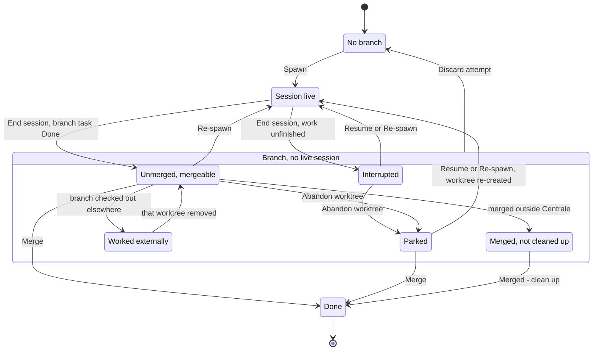

# Centrale board

Where a task is in its lifecycle and what you can do next; then using
the board — cards, the drawer, the live session pane, the session
theater, replying — and opening a project's own Backlog.md board. Part of
the Centrale manual; the [README](../README.md) is the front door and
lists the other chapters.

## The task lifecycle

Where a task is, and what you can do next. Every state below is derived
on each read from backlog + git + tmux — Centrale stores no lifecycle
state of its own — so this map is a reading of the predicates the
frontend actually decides with, named here exactly as the code spells
them: `findLiveSession`, `effectiveHasSpawnBranch`, `worktreeDirty`,
`branchCheckout` (`externalCheckout` / `parkedBranch`), `alreadyMerged`,
`drawerBranchStatusIsActive` (which is `isActiveStatus` applied to the
branch's own copy of the task), plus `endSessionArmReason` and
`liveSessionBlockReason` for the two sentences a blocked action explains
itself with. A test pins those names and the action labels below against
`static/` so this page cannot quietly drift from the buttons (see
`tests/test_source_contract.py`).



A live session outranks every branch signal: while `findLiveSession`
returns a session, the task is in **Session live** whatever its worktree
or branch looks like. Otherwise the branch decides, and an external
checkout outranks the rest of the branch states — the diagram draws that
edge from **Unmerged, mergeable** to keep it readable, but *any* branch
state becomes **Worked externally** the moment its branch is checked out
somewhere Centrale doesn't manage, and comes back when that worktree is
removed. **Discard attempt** likewise leaves three of the branch states
— **Interrupted**, **Unmerged, mergeable** and **Parked**, never a merged
or externally checked-out branch — which is why the diagram draws it from
the group rather than from each one.

| State | How Centrale decides it | Offered | Why the rest is absent |
| --- | --- | --- | --- |
| **No branch** | `effectiveHasSpawnBranch` false and `findLiveSession` null | **Spawn agent** on the card and in the drawer — but only while the task is `ready`; the label becomes "Spawn (name)" when the task has an assignee | Everything else needs a `task/<id>` branch to act on. A task that is not ready (blocked, or already Done) gets no action at all, which is why a Done card is bare. |
| **Session live** | `findLiveSession` returns a session for this project + task | **End session** (always — see below), the live pane's reply row and its Esc/Enter keys | Merge, **Abandon worktree, keep branch** and **Discard attempt** are rendered *disabled*, carrying `liveSessionBlockReason`: the server refuses all three while the session runs — Abandon and Discard outright, Merge by failing its first gate, `noLiveSession` — and Centrale will not delete a worktree from under a running agent. The drawer's Spawn button is disabled and reads "Session already running"; the card's reads "Session live", disabled, with the session name in its tooltip. **Resume agent** and **Re-spawn agent** are not rendered at all — both require no live session, and End session is the way out. |
| **Interrupted** | a branch, no live session, not externally checked out, and either `worktreeDirty` or `drawerBranchStatusIsActive()` | **Merge** (primary), then one row: **Resume agent**, **Re-spawn agent**, **Abandon worktree, keep branch** (only with a Centrale worktree), **Discard attempt** | Spawn is gone because a branch already exists — sending an agent back into it is Resume or Re-spawn, not a fresh start. "Merged — clean up" needs `alreadyMerged`. |
| **Unmerged, mergeable** | a branch, no live session, not external, clean worktree, and the branch's own task is *not* in an active status | **Merge** (primary), **Re-spawn agent**, **Abandon worktree, keep branch**, **Discard attempt** | **Resume agent** is withheld: this is a merge candidate, not a resume candidate. A branch whose status hasn't been read yet keeps this same shape until `/api/task` lands. |
| **Parked** | `parkedBranch(task)` — `branchCheckout.kind` is `"none"`: the branch exists and is checked out nowhere | **Merge**, **Re-spawn agent** (and **Resume agent** if the branch's task is still active), **Discard attempt**. Either spawn action re-creates the worktree | **Abandon worktree, keep branch** is absent because there is no worktree left to abandon — that button only renders for `branchCheckout.kind` `"centrale"`. |
| **Worked externally** | `externalCheckout(task)` — `branchCheckout.kind` is `"external"`: the branch is checked out in a worktree Centrale doesn't manage | Nothing clickable: a disabled **Worked externally** button plus `externalCheckoutReason` in the open, and a Merge disabled with `externalMergeReason` | git refuses a second checkout of the same branch and won't delete a branch that is checked out, so Spawn, Resume, Re-spawn and cleanup could only 409. Discard and Abandon aren't rendered at all — the reason is already on screen twice. Finish or remove that worktree to hand the branch back (see ["Branches worked outside Centrale"](agents.md#branches-worked-outside-centrale)). |
| **Merged, not cleaned up** | `alreadyMerged` — the branch is fully merged into the base *and* main's copy of the task is Done, but the branch is still there | **Merged — clean up** (primary), with **Re-spawn agent** still in the row | Merge would only ever refuse. **Discard attempt** and **Abandon worktree, keep branch** are withheld deliberately: the work is already on the base, cleanup is the correct removal, and a forced delete would be a noisier way to do the same thing. |
| **Done** | no branch, and the task is not `ready` | Nothing, anywhere | This is where Merge and clean-up land. New work on an already-merged task is a new task, not a re-spawn of this one. |

### Three questions this map answers

- **Why Resume here and only Re-spawn there?** Resume needs the branch to
  look *unfinished*: `worktreeDirty`, or `drawerBranchStatusIsActive()` —
  the branch's own copy of the task still in an active status (neither
  Done nor the board's first column). An agent killed just *after*
  committing leaves a clean worktree, so `worktreeDirty` alone called it
  finished; reading the branch-side status is what makes it resumable
  again. That status must come from the branch, never from main: a
  spawn pins main at its claim commit for the branch's whole life, so
  main says "In Progress" for a finished branch too. The card's amber
  **interrupted** badge is deliberately narrower — it keys on
  `worktreeDirty` alone, because the board has no branch-side copy of
  the task to read (see "Using the board" below). The drawer is where
  interrupted-ness becomes an action.
- **Why is End session missing?** It isn't, for a live session: since
  task-120 every session `findLiveSession` returns gets an End session
  button, and since task-132 it is never disabled for the agent's state.
  A `working` agent arms on the first click (`endSessionArmReason`
  spells out why, under the button) and ends on the second; every other
  state, `unknown` included, ends on one click. `unknown` is the state a
  server restart leaves every running session in — lifecycle badges are
  in-memory — and it used to be the one state with no button, which left
  the whole drawer with nothing to click. If there is no End session,
  there is no live session: the badge you are looking at is a
  branch-derived one.
- **Why are Discard and Abandon gone?** Either a session is live — they
  are still on screen, disabled, with `liveSessionBlockReason` under them
  pointing at End session — or the branch is already merged, where
  **Merged — clean up** replaces both, or the branch is checked out
  outside Centrale, where neither is rendered. **Abandon worktree, keep
  branch** additionally needs a Centrale worktree to abandon, so a parked
  branch offers only the discard.

## Using the board

- **Columns** are the union of every configured project's statuses, in
  canonical order (To Do, In Progress, Done), followed by any other statuses
  observed in task data. A task whose status doesn't match any known column
  for its project falls into a catch-all "Other" column.
- **Cards** show the task ID and title, a project chip (color is a stable
  hash of the project name, so it stays consistent across refreshes), a
  priority pill (high/medium/low), a milestone chip if the task has a
  milestone (its title, accent-tinted and pill-shaped, so it doesn't read
  as another label — falling back to the raw `m-0` id if the title can't
  be resolved), and any labels. A card also shows a green "ready" dot if
  the task is unblocked, or a gray "blocked" badge if it is not ready
  *and* its status is the project's first (todo-like) column. A card for a task
  with an unmerged `task/<id>` branch also gets an amber "unmerged branch"
  dot — main's status can be stale for such a task (see "Merging finished
  branches" in [docs/merging.md](merging.md#merging-finished-branches)), so this is shown independently of it — or, if that branch's
  worktree has uncommitted changes and no live session (an agent's session
  died mid-work), a more prominent amber "interrupted" badge instead. The
  badge is keyed on that dirty worktree alone, which is narrower than the
  drawer's Resume offer — an agent killed just *after* committing leaves a
  clean worktree, and only the drawer reads the branch-side status that
  gives it away (see "Resuming an interrupted agent" in
  [docs/agents.md](agents.md#resuming-an-interrupted-agent)).
- Cards are sorted by priority (high, medium, low, then unset), then by
  ordinal.
- **Filter controls**: the sidebar's text search box filters cards
  client-side, case-insensitively, by title, task ID (the full ID or its
  numeric portion), or label; above the board, a "Ready to start" switch
  filters to ready tasks and a **Milestone** dropdown narrows every lane
  to one milestone.
  Its entries are derived from the loaded board data alone — no milestone
  endpoint — scoped to the projects currently selected in the sidebar, and
  each shows that milestone's title and its done/total count. It defaults to
  "All milestones" and hides itself entirely when no loaded task has a
  milestone.

  Milestone ids are assigned **per repo**, so every repo has an `m-0` and the
  id alone identifies nothing across the board. Each entry is therefore one
  project's milestone: two projects that both use `m-0` get two entries, and
  selecting one narrows that project's lanes only. When two projects have
  milestones with the *same title*, both entries name their project as well.
  Identity stays the id, so renaming a milestone in backlog doesn't drop the
  selection; the title is display only. (Selections stored before this
  distinction existed are ignored, so the filter starts at "All milestones"
  once after upgrading.)

  Centrale only *surfaces* milestones: creating, renaming and closing them
  stays `backlog milestone`'s job. The one milestone read it makes is
  `backlog milestone list --plain --show-completed`, once per board build
  per project that has a milestone to resolve at all, to map id → title;
  a project with no milestones, or a listing it can't parse, simply keeps
  showing ids.
- **Project selection** (sidebar): clicking a project row shows only that
  project ("solo"); clicking the already-solo'd row restores all. Each
  row also has a small checkbox — and Ctrl/Cmd+click on the row does the
  same thing — to toggle just that one project on/off independently,
  without affecting the others. An "All" reset action appears in the
  PROJECTS section header whenever any filtering is active. Keyboard:
  Enter solos, Ctrl/Cmd+Enter toggles, Space toggles a focused checkbox.
  The project selection, the "Ready to start" switch, the milestone choice,
  and an explicit sidebar-collapse choice all persist in `localStorage`
  (`centrale-` prefixed keys, try/catch-wrapped like the theme setting)
  and are restored before the first render on the next visit — a project name no
  longer in `projects.json` is dropped silently, and a stored selection
  that's empty (or missing entirely) is treated as "everything active."
  Search text, the open drawer, and toasts are intentionally not
  persisted.
- The board **auto-refreshes every 10 seconds** (a countdown is shown next to
  a "Refresh" button); the Refresh button forces an immediate reload that
  bypasses the server's cache.
- **Clicking a card** opens a right-side drawer with the task's milestone
  (a "Milestone" row at the top of the summary, shown only when it has
  one), description, acceptance criteria (a read-only checklist reflecting
  each item's checked state), dependencies (each shown with the resolved
  status of that dependency from the current board data, or "unknown" if
  it can't be resolved), and, if present, the implementation plan and
  implementation notes. The drawer also has the Spawn button described in
  [docs/agents.md](agents.md#spawning-an-agent).
- **Self-announcing sections.** Every section of that summary carries a
  header that says what it holds without scrolling to it: acceptance
  criteria as a checked/total count ("2/6"), dependencies as a count,
  and description/plan/notes as a word count. Clicking a header folds
  that section away and unfolds it again, so one long description can't
  push the rest of the ticket out of view — useful when a live session
  pane is sharing the drawer's height. Sections holding a lot (more than
  60 words of text, or more than 5 items) start folded; smaller ones
  start open, so a short ticket still opens showing everything. Folding
  hides nothing permanently and removes nothing: it is the same content,
  in the same order, one click away. An explicit fold or unfold is
  remembered per section in `localStorage` (`centrale-drawer-sections`)
  and wins over that size-derived default from then on. A fade at the
  bottom edge of the drawer's body appears whenever more remains below.
- While a spawned agent's `task/<id>` branch is unmerged, the drawer
  shown above reflects `main`, which won't see the agent's own status/AC/
  notes updates until that branch is merged. A separate, clearly-labeled
  **"On agent branch (unmerged)"** section shows the branch's own status,
  checked ACs, and implementation notes instead, so you can see a spawn's
  real progress before merging it (see "Merging finished branches" in
  [docs/merging.md](merging.md#merging-finished-branches)).
  That copy is read wherever the branch actually lives — its Centrale
  worktree, a foreign checkout, or a detached snapshot of a parked branch
  — and the section appears only where it actually differs from main's.
- **Two ways out of a bad attempt**, under the drawer's Merge action,
  clickable while the task has an unmerged branch and no live session (a
  live session renders them disabled, naming it):
  **Discard attempt** (worktree removed, branch deleted, the
  ordinary Spawn button back) and **Abandon worktree, keep branch** (only
  the worktree goes; the branch parks and stays mergeable). Both take two
  clicks, and the second click's label names exactly what would be
  destroyed — "Discard 3 commits and 4 uncommitted files?" — measured at
  the moment you ask. The discard leaves a recovery tag and hands back the
  `git branch` command that undoes it; see
  ["Discarding a bad attempt"](agents.md#discarding-a-bad-attempt).
- **Live session pane.** When the drawer's task has a live Centrale tmux
  session (and `sessionPreview.mode` isn't `"off"`), a "Live session pane"
  section shows the last ~40 rendered lines of that session's pane as
  plain text — what `tmux attach` would show, minus color and with long
  runs of rule characters clipped so TUI chrome fits the drawer — so
  you can read what a "waiting for input" agent is asking without leaving
  the browser. It refreshes for as long as the drawer stays open, via
  `GET /api/session-pane` (one `tmux capture-pane` per tick, only for the
  one open drawer — never per session, so it costs the same with one
  agent or twenty). The rate follows what is happening: about every 2
  seconds normally, every second while the agent badge says *working*,
  and about three times a second for a few seconds after you send a
  reply, so your text landing and the agent starting to answer read as
  one continuous motion instead of a pause and a jump. The header shows the capture
  time and a ticking "Ns ago" age; if a refresh fails or the capture is
  older than ~10s it's labeled *(stale)* in amber, so a frozen capture
  is never mistaken for live output. The pane shows the agent's whole
  screen and no more: an agent TUI redraws a fixed viewport instead of
  scrolling output off the top, so tmux keeps no scrollback for it and
  there is no earlier output to fetch, however many lines the drawer
  asks for. Sessions are created 220x200 so that screen is worth reading —
  200 rows because that is exactly the largest window the drawer and
  theater ever ask for, so what they request is what a pane can supply
  (see "Spawning an agent" in [docs/agents.md](agents.md)). The pane
  follows the newest output unless you've scrolled up to read something
  earlier. Pane refreshes
  update only that section — they never re-render the board or disturb
  lane scroll positions. The section disappears on its own when the
  session ends or the drawer closes.
- **Session theater.** The pane section header's **Maximize** button opens
  the live pane in a large, centered in-page overlay (roughly 90% of the
  window's width and 85% of its height, over a dimmed backdrop) — the
  reading-and-replying tier above the drawer's **Expand** glance tier. It
  is the very same pane section, moved into the overlay: same capture,
  same age label, and (in the `"interact"` tier) the same reply row docked
  at the bottom, so there is still exactly one poll and replying
  behaves byte-for-byte as it does in the drawer. It always opens on the
  newest output, at the bottom of the capture — the theater shows the
  agent's whole 200-line window where the drawer shows a 40-line tail, so
  there is no shared position to preserve, and reading what the agent is
  doing right now is the point of the control. In the `"view"` tier the
  theater has no reply row; when `sessionPreview.mode` is `"off"` there is
  no pane section and so no theater. Esc, a click on the backdrop, or the
  header's **Close** button returns the section to the drawer exactly as
  it was (the scroll positions it had when you opened the theater); a
  second Esc then closes the drawer
  — one Esc never closes both. Opening or closing the theater never
  re-renders the board or touches lane scroll positions, and it is never a
  browser window or popup.
- **The theater's task rail.** Beside the terminal, the theater shows the
  open ticket itself: status, milestone, labels, description and the
  acceptance criteria — the criteria read from the agent's own
  `task/<id>` branch when there is one (the panel says which copy you are
  looking at), so the ticks move as the agent works rather than showing
  main's stale copy, and a second chip carries the branch's own status
  whenever it has moved ahead of main's.
  It is read-only on purpose: Spawn, Merge, Resume and End session stay
  in the drawer. **Hide task** in the header collapses the rail and gives
  the pane the whole window; **Show task** brings it back, and the choice
  is remembered for the next theater you open. On a window narrower than
  1000px the rail hides itself so the 80-column pane still fits.
- **Replying from the drawer.** With `sessionPreview.mode` at `"interact"`
  (the default), the live pane gets a reply row underneath: a one-line
  text box (Enter or the **Send** button types the line into the session
  followed by Enter), and beside it **Esc** and **Enter** buttons that
  send those two keys themselves. `POST /api/session-input` drives tmux
  against that one exact session, delivering the line as a bracketed paste
  (`load-buffer` + `paste-buffer -p`) followed by Enter, so the agent's
  paste heuristic can't swallow the Enter the way a raw keystroke burst
  let it; a key goes as a single `send-keys` carrying the key *name*.
  Single-line text and those two keys only: no multi-line input, no arrow
  keys, no interrupt — for anything beyond a short answer, attach.
  Be aware the pane is a *polled capture*,
  so the prompt can move on between the capture and your keystroke; that
  is mitigated, not solved: the capture age sits right next to the input,
  and sending is blocked (greyed, with the reason) when the session is
  gone, a refresh failed, or the capture is older than ~10s — the server
  independently refuses a reply without a fresh capture of its own. After
  a send the pane re-captures immediately so you see the effect. Escape
  inside the reply box clears it (or drops focus) rather than closing the
  drawer. Turn the row off in Settings; the pane stays read-only.
- **The two keys are for a session that text cannot reach.** A `claude`
  session can be stopped dead by a startup dialog — an onboarding modal
  offering to scan your shell history, say. The reply box is no use
  against one: the line lands where there is no prompt, and the Enter it
  appends confirms whichever option the dialog has focused. **Esc**
  dismisses that dialog and the replies queued behind it are processed;
  **Enter** confirms whatever the pane has focused. There is no
  confirmation step in front of either — the terminal directly above the
  buttons is how you see what you are about to press, and a key sent
  against a stale capture is blocked by the same gate as a typed reply.
  These two came back (task-135) after task-77 removed all three original
  quick keys; the third, `y`, stayed removed, and arrow keys and Ctrl-C
  have never been offered.
- The sidebar's **Sessions** section lists currently live tmux sessions
  Centrale is aware of, each with its attach command, a copy button, and the
  files it has touched so far (tracked changes plus untracked files in its
  worktree, capped at 20 with a "+N more" count; omitted if the worktree is
  gone) — dequoted the same way "Merging finished branches" in
  [docs/merging.md](merging.md#merging-finished-branches) describes,
  so a spaced Backlog.md filename shows up as itself, not wrapped in stray
  literal double quotes. It refreshes on the same 10-second cycle as the
  board.
- **Spawning while another session is already live in the same project**
  requires an extra click: the button first flips to "N agents active —
  spawn anyway?" (hovering it shows what those other sessions have
  touched), and a second click within a few seconds actually spawns. With
  no other live session in the project, spawning is still a single click.
- If a project fails to load, it shows a warning marker on its chip and an
  error banner naming the problem. If no projects are configured at all
  (including a genuine zero-config first run), the board shows a "Welcome to
  Centrale" hint pointing at the Settings gear instead of the columns.
- Every project chip has an **"open board" button** (⧉) that opens that
  project's full Backlog.md web UI in a new browser tab, at the board root;
  the task drawer's **"Open task"** button opens the same web UI on the open
  task's own detail view — see "Opening a project's Backlog.md board" below.
  The drawer also shows the task's assignee (or "unassigned").

## Opening a project's Backlog.md board

Clicking the ⧉ icon on a project chip, or the "Open task" button in the
task drawer, sends `POST /api/browser` with that project's name. On the
server side this (see `browser.py`):

1. Validates the project name (404 if unknown).
2. Assigns that project a stable port — `browserPortBase` (default `6421`)
   plus the project's position in `projects`, or its own `browserPort` if
   set (see "Setup / configuration" in [docs/configuration.md](configuration.md#setup--configuration)).
3. If a `backlog browser` process **this server itself already launched**
   is alive on that exact port, reuses it. Otherwise, before launching
   anything, bind-checks the assigned port (`server.port_is_free`): if
   it's genuinely free, launches `backlog browser --port <port> --no-open
   --non-interactive` there as usual. If something we don't already have
   a tracked, live process for is squatting it — a different program
   entirely, or an orphaned `backlog browser` from an earlier run (see
   below) — that port is never handed out. Instead, Centrale walks forward
   to the next free port it can verify (up to 50 ports past the assigned
   one) and launches there explicitly with `--port`, **without**
   `--non-interactive`: that flag is exactly what let a taken port fail
   *silently* in the first place (`backlog` would rebind itself
   somewhere else without saying so, and the caller — Centrale — had no
   idea), so the fallback launch deliberately asks for the opposite: if
   even the verified port turns out to be lost in a race, fail loudly
   instead of drifting to a third port nobody checked.
4. Whichever port it launched on, Centrale doesn't hand out the URL until
   it's confirmed: polls briefly (up to 2 seconds) for the port to
   actually start refusing new binds (meaning something is now listening
   there) while confirming the launched process itself is still alive.
   A child that exits immediately, or a process that stays alive but
   never starts listening within that window, is reported as a clear
   launch error instead of a URL nothing answers on. Once confirmed,
   Centrale also resolves whatever's *actually* listening on that port
   (`ss -tlnp`, falling back to `lsof` where there's no `ss` — macOS) —
   `backlog browser` is a node wrapper that immediately forks the real,
   long-running server, which reparents to the user's systemd (`--user`)
   instance almost immediately, so the wrapper pid
   `backlog browser` was launched as and the pid genuinely holding the
   port are two different processes. Both pids (the wrapper's always;
   the real listener's too, if resolution succeeds — a one-line log
   message if it doesn't, and cleanup then only tracks the wrapper, same
   as before this existed), plus port/project name/start time, are
   recorded in a small runtime registry (see below) — this is process-
   lifecycle state, not task state; it lives in the user's cache
   directory, not anywhere under a project's own repo.
5. Responds with `{"url": "http://127.0.0.1:<port>", "versionDrift": ...}`
   — the board's base URL, and nothing task-specific: launching and
   registering the browser process is the server's whole job here.
   `versionDrift` is the staleness check below, `null` in the normal case.

The frontend opens that URL in a new tab, and appends the task path when
it has one. A project chip opens the base URL as-is (the board root); the
drawer's "Open task" appends `/board/<TASK-ID>` (URL-encoded), which is
the route Backlog.md's own web UI uses to open the Kanban board with that
task's detail view on top of it — so you land on the task you had open,
not on the board root with the task to find again by hand. Dotted subtask
ids (`TASK-11.4`) need no escaping of their own: dots are legal in a path
segment, unlike in a tmux session name.

Centrale installs SIGTERM (and SIGINT) handlers so a normal server stop —
`pkill`, `systemctl stop`, Ctrl-C — unwinds cleanly and runs its atexit
cleanup, which makes a best-effort attempt to terminate every
`backlog browser` process it launched — both the wrapper (directly, via
the live handle Centrale already holds) and the real listener underneath
it (guarded, like the boot sweep below) — and drops their registry
entries, since they're being shut down cleanly, not orphaned. This is
*not* guaranteed for a `kill -9`/SIGKILL, which skips all Python-level
cleanup unconditionally (true of any process, not something Centrale can
work around) — but a SIGKILLed server still heals itself on its *next*
boot: every server start reads `~/.cache/centrale/browsers.json` (or
`$XDG_CACHE_HOME/centrale/browsers.json`) and sweeps it, for each
recorded entry, each of its pids (wrapper and, if it was resolved, the
real listener) is independently checked: if it's still alive **and**
its cmdline (`/proc/<pid>/cmdline`, or `ps` where there's no procfs)
still actually looks like a `backlog browser` process, it's killed;
otherwise (already dead, or the pid has since been reused by some
unrelated process — never kill on pid alone) that pid is left alone. An
entry counts as swept if either of its pids was actually killed; the
whole entry is dropped from the registry either way — a server that
never resolved the real listener pid at launch time (an older Centrale
process, or one where neither `ss` nor `lsof` could name it) still gets
its wrapper pid swept exactly as before. One line is logged at startup if there was
anything to report.

Registering a launch reconciles the file first: any entry already recorded
for *that same project* whose process is gone — neither of its pids alive
and still looking like a `backlog browser`, the same guard the sweep
decides by — is dropped before the new one is appended. So relaunching a
project's board within one session leaves exactly one entry for it rather
than a dead one beside the live one; before this, the registry
misrepresented what was running until the next restart swept it, and it is
the same file that sweep trusts to decide what to kill. An entry for that
project whose process is *still* alive is kept (two live boards for one
project is a shape the sweep should see, not one to forget), entries for
other projects are never touched, and dropping an entry never signals
anything — only the sweep kills. If the server process itself is never going to
restart, sweep by hand instead:

```bash
pkill -f 'backlog browser'
```

### A board keeps the version it started with

Upgrading backlog.md on disk does not touch a `backlog browser` already
running: after a 1.50.1 → 1.51.0 upgrade, three boards Centrale had
launched days earlier went on answering 1.50.1 while `backlog --version`
in the terminal said 1.51.0 — the web UI's footer disagreed with the
shell and nothing explained why. This is the same class of problem as the
stale *Centrale* process one layer up (the banner under "The board" —
same reasoning, same refusal to guess), and the difference is that a
board's version is trivially queryable: it serves `/api/version` over
HTTP on the port Centrale's own registry already knows.

So on every open, right after the launch-or-reuse above, Centrale asks the
board what version it is running and compares that with `backlog
--version` on `PATH`. When they differ, the answer carries `versionDrift`
and the UI raises a toast beside the board that was just opened, naming
both versions and the fix: **stop that board and open it again**. That
toast does not auto-dismiss — opening a board moves focus to the new tab,
so a message about it in the old one would expire unseen — and it stays
until its ✕ is clicked.

Centrale kills and restarts nothing on a version difference. It launched
those processes, but you may be reading one, so stopping it stays your
call (`pkill -f 'backlog browser'`, or by pid from the registry below).
And any doubt is silence rather than a warning: a board that does not
answer, no `backlog` on `PATH`, or two answers that agree all report
`null`. A false "your board is stale" would teach you to ignore the true
one.

Errors (e.g. an unknown project, or a launch failure) show up as a
dismissible toast in the top-right of the page rather than blocking the UI.
